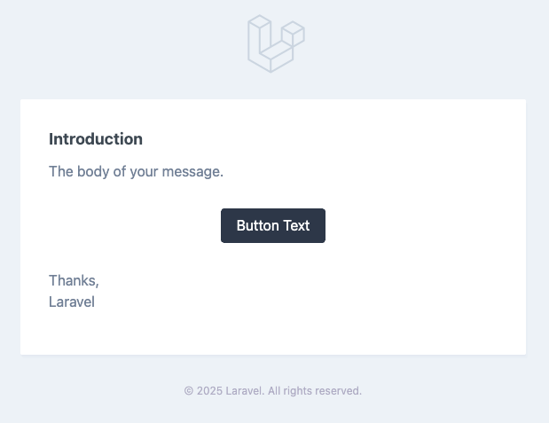
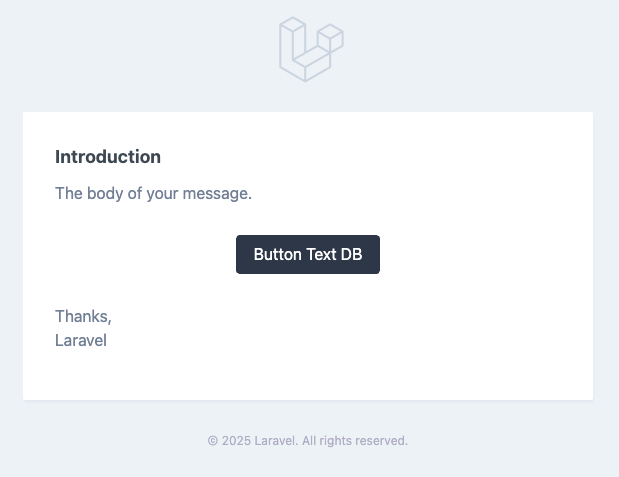

## DbMail

### Overview

A Laravel package that allow your customers to edit email templates (html and markdown).

## Installation

### Requirements
The package has been developed and tested to work with the following minimum requirements:

- PHP 8.0
- Laravel 8.0

### Install the Package
You can install the package via Composer:

```bash
composer require skywebdev/laravel-db-view
```

### Migrate the Database
This package contains migration that add table: ``` blade_templates ```.
To run these migration, simply run the following command:
```bash
php artisan migrate
```

### Import existing blade templates
After migration you should run following seeder that will import email templates to database.

```bash
php artisan db:seed --class="SkyWebDev\Database\Seeders\AddBladeTemplatesSeeder"
```
You should run this seeder whenever new email template is added.

## Using

After installation your Mailable class will read body and subject from table ``` blade_templates ```. You can 
allow 
customers to change 
them on front using rich text and markdown editors.

### Routes

Package contains CRUD routes for maintaining ``` blade_templates ``` tables. Nothing special, I would just emphasize that 
delete is actually revert to original. Delete will revert content and subject to be same as defined in blade file.
Update and delete will clear view cache.

| Verb   | URI                             | Action  | Name                    |
|--------|---------------------------------|---------|-------------------------|
| GET    | /blade-templates                | index   | blade-templates.index   |
| POST   | /blade-templates                | create  | blade-templates.create  |
| GET    | /blade-templates/{bladeTemplate} | show    | blade-templates.show    |
| PUT    | /blade-templates/{bladeTemplate}                | update  | blade-templates.update  |
| DELETE | /blade-templates/{bladeTemplate}                | destroy | blade-templates.destroy |

## Example

Create markdown mail

```bash
php artisan make:mail TestMail --markdown=test_mail
```

This command will create ``` App\Mail\TestMail```

```php
<?php

namespace App\Mail;

use Illuminate\Bus\Queueable;
use Illuminate\Contracts\Queue\ShouldQueue;
use Illuminate\Mail\Mailable;
use Illuminate\Mail\Mailables\Content;
use Illuminate\Mail\Mailables\Envelope;
use Illuminate\Queue\SerializesModels;

class TestMail extends Mailable
{
    use Queueable, SerializesModels;

    /**
     * Create a new message instance.
     *
     * @return void
     */
    public function __construct()
    {
        //
    }

    /**
     * Get the message envelope.
     *
     * @return \Illuminate\Mail\Mailables\Envelope
     */
    public function envelope()
    {
        return new Envelope(
            subject: 'Test Mail',
        );
    }

    /**
     * Get the message content definition.
     *
     * @return \Illuminate\Mail\Mailables\Content
     */
    public function content()
    {
        return new Content(
            markdown: 'test_mail',
        );
    }

    /**
     * Get the attachments for the message.
     *
     * @return array
     */
    public function attachments()
    {
        return [];
    }
}
```

and view file ``` resource/views/test_mail.blade.php ``` in markdown format

```bash
<x-mail::message>
# Introduction

The body of your message.

<x-mail::button :url="''">
Button Text
</x-mail::button>

Thanks,<br>
{{ config('app.name') }}
</x-mail::message>

```

In ``` routes.web.php ``` add route for displaying mail.

```php
<?php

use Illuminate\Support\Facades\Route;

Route::get('/mail', function () {
    return (new \App\Mail\TestMail());
});
```
Call ``` <app_url>/mail ``` in browser and you will see something like this



Run seeder for adding blade templates to db

```bash
php artisan db:seed --class="SkyWebDev\Database\Seeders\AddBladeTemplatesSeeder"
```
This seeder will add newly added template to ``` blade_templates ``` table.

Next, edit body column of newly added template in ``` blade_templates ``` table. For example append DB in button label.

```bash
<x-mail::button :url="''">
Button Text DB
</x-mail::button>
```
Refresh ``` <app_url>/mail ``` in browser and you will see something like this



Template is rendered from db. 


